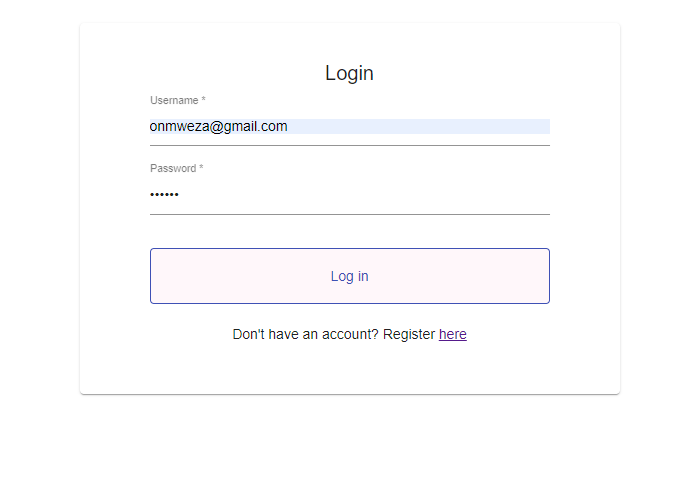
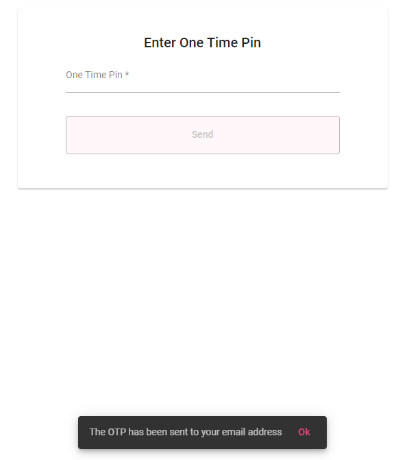
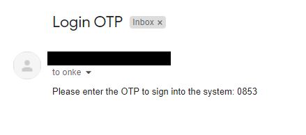
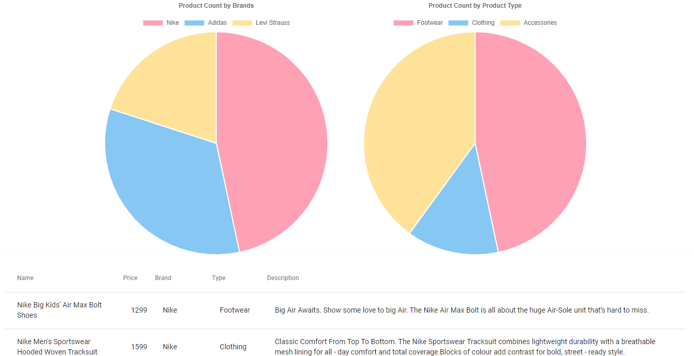
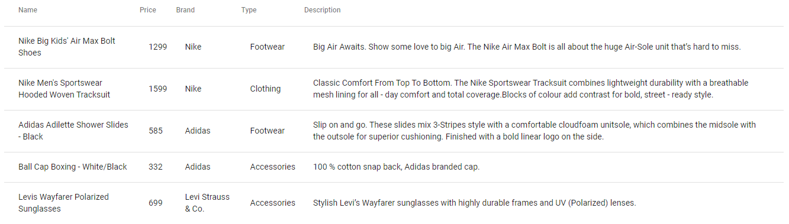

The application allows for new users to register, log in to the dashboard (incorporate
email and a one-time pin (OTP)), and view the product's dashboard.

# Login page:
o The login page requires a Username (a valid email address) and a Password to proceed with logging
in. If the username or password is not provided the logging in will be prevented.
 
o If the username or password is invalid (does not match a user in the database) a notification
message will be displayed.
 
o When the user clicks on the link to register by “Don’t have an account? Register here” they will be
redirected to the Register page.
 
o When the user entered valid user credentials, an email with a 4-digit OTP will be sent to the user's
email address and they will be redirected to the OTP page.
 
# Register page:
o The register page requires a valid email address and a valid password (between 6 to 16 characters
is allowed) to proceed with registering. If the email address or password is not provided the registration
will be prevented.
 
o If the user account already exists (matches a user in the database), a notification message
will be displayed
 
o When the user is successfully registered, they will be redirected to the Login page
 
o The password stored in the database is hashed.
 
# OTP page:
o Once the user entered their valid credentials on the Login page, they can enter the 4-digit OTP sent to the email
address.
 
o The OTP is required to be able to continue.
 
o If the user enters an invalid OTP (which does not match the OTP in the email and stored on the
server), a notification message will be displayed.
 
o When the user enters a valid OTP, they will be redirected to the ProductDashboard page
 
# ProductDashboard page:
o The product dashboard will display 2 pie charts. One for the Product count grouped by Brands, and
the other for the Product count grouped by Product Type.
 
o On the same page, a table of the products is displayed
 
# Screenshots

